# 🏗️ DELIVERY SYSTEM ARCHITECTURE

**Alpha Appeal Platform**  
**Architecture Version:** 2.0  
**Last Updated:** March 31, 2026

---

## 📐 HIGH-LEVEL ARCHITECTURE

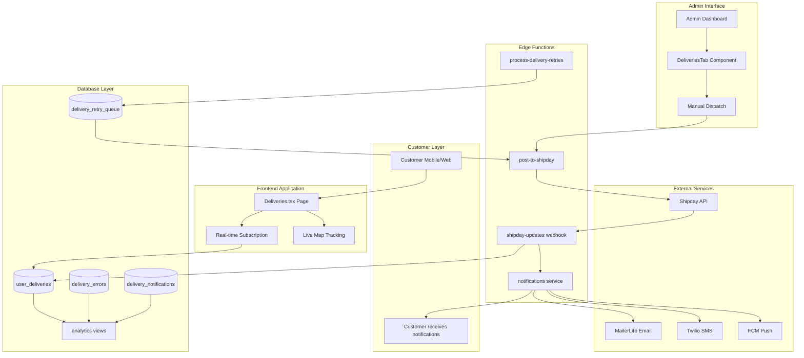

---

## 🔄 DATA FLOW DIAGRAMS

### Flow 1: Order Creation to Delivery Assignment

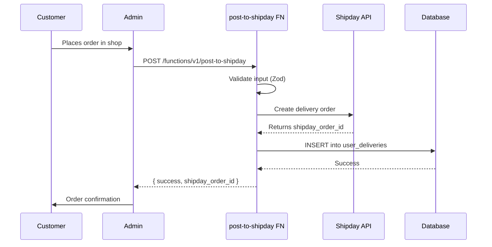

### Flow 2: Webhook Status Updates

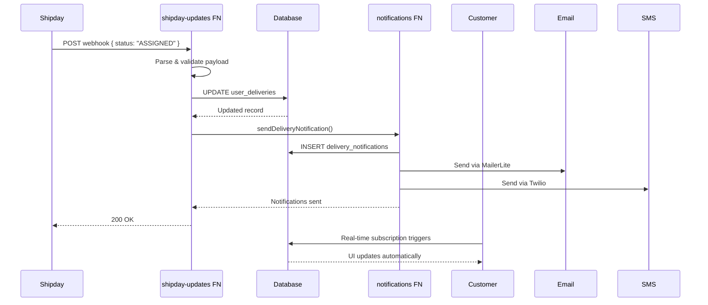

### Flow 3: Error Handling & Retry

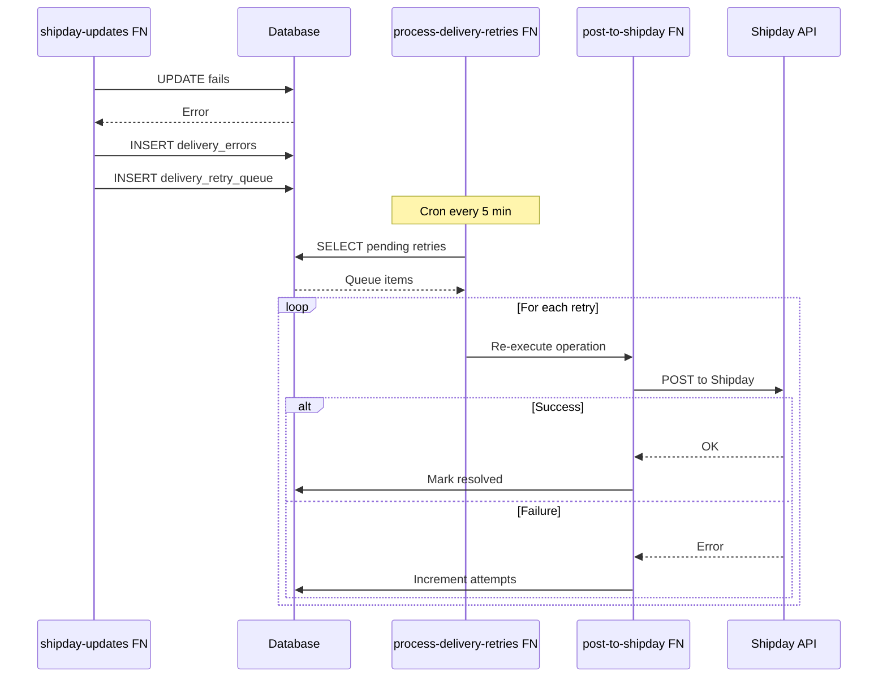

---

## 🗄️ DATABASE SCHEMA DIAGRAM

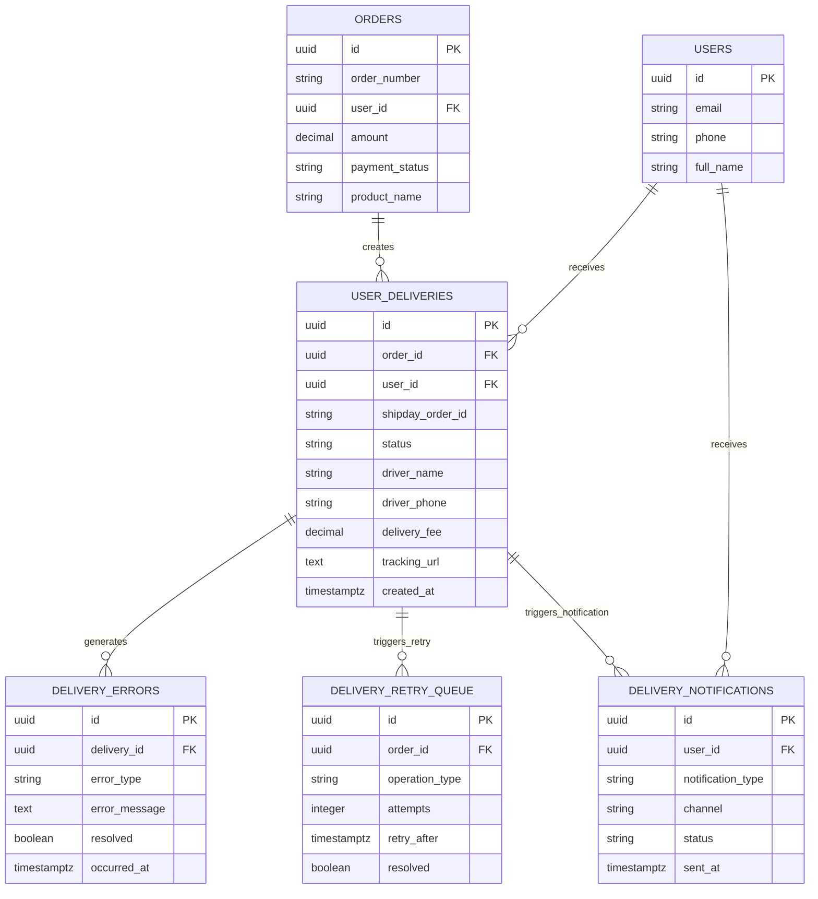

---

## 🔧 COMPONENT BREAKDOWN

### Edge Functions Architecture

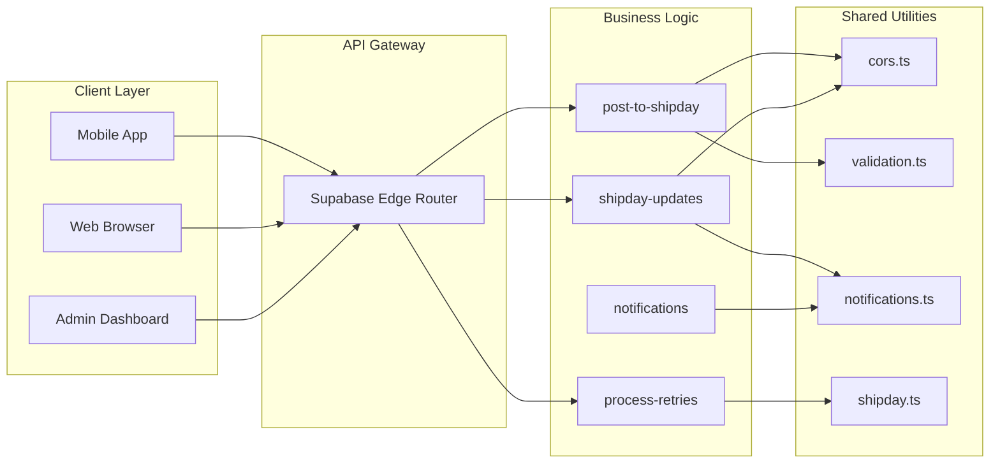

---

## 🌐 INTEGRATION POINTS

### Shipday Integration

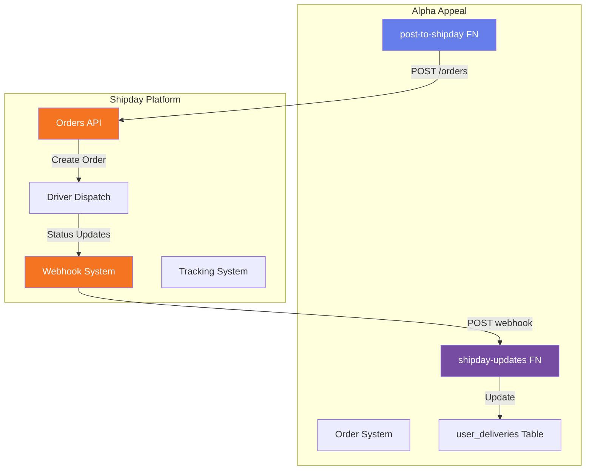

### Notification Flow

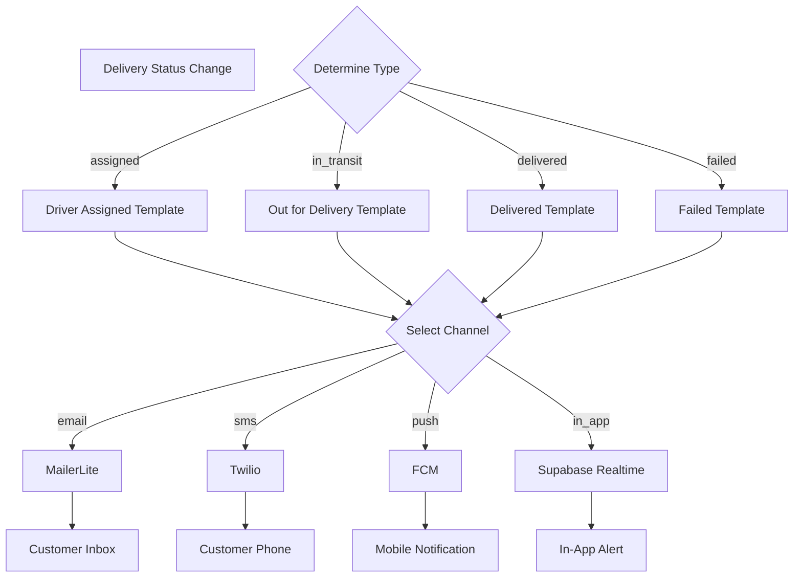

---

## 📊 MONITORING ARCHITECTURE

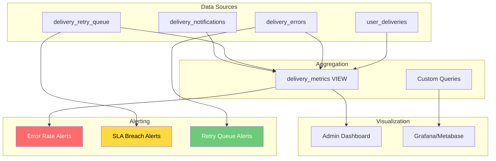

---

## 🔐 SECURITY ARCHITECTURE

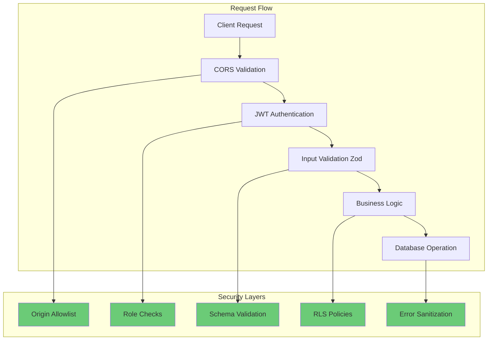

---

## 🎯 DEPLOYMENT ARCHITECTURE

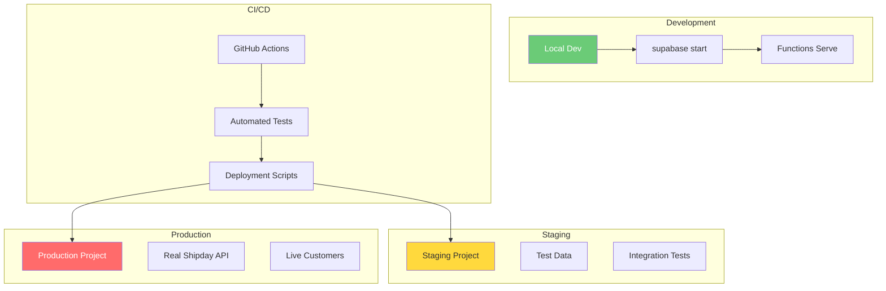

---

## 📈 SCALABILITY CONSIDERATIONS

### Current Architecture
- **Single Database:** Supabase PostgreSQL
- **Edge Functions:** Serverless, auto-scaling
- **Webhooks:** Processed in real-time
- **Notifications:** Sent synchronously

### Scaling Strategy (Phase 2+)

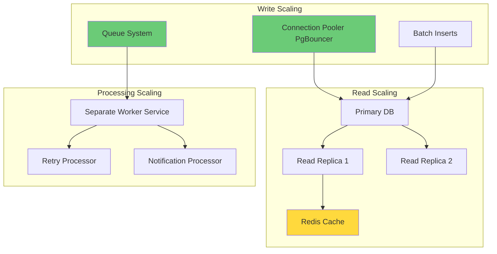

---

## 🔄 STATE MACHINE

### Delivery Status Flow

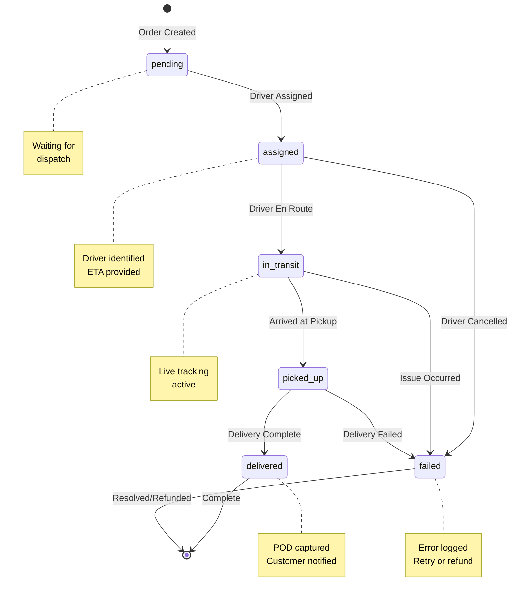

---

## 🧩 MODULE DEPENDENCIES

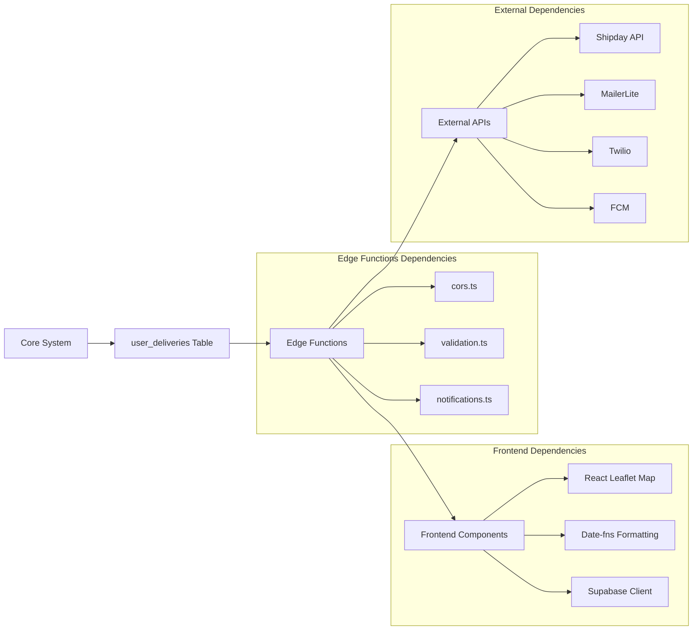

---

## 📱 MOBILE VS WEB ARCHITECTURE

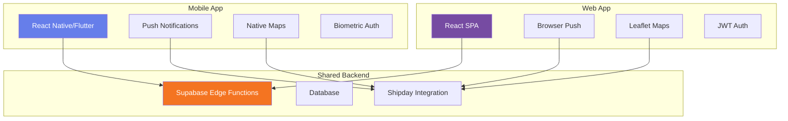

---

## 🎨 FEATURE ROADMAP ARCHITECTURE

### Phase 1 (Current) ✅
```
Basic Tracking → Webhook Handler → Error Logging → Retry Queue
```

### Phase 2 (Next) 🔄
```
Notifications → Live Map → Timeline View → Analytics Dashboard
```

### Phase 3 (Future) 📋
```
AI Route Optimization → Multi-Driver Support → International Shipping → Carbon Offset Tracking
```

---

**Architecture Review Schedule:** Quarterly  
**Next Review Date:** June 30, 2026  
**Architecture Owner:** Lead Systems Architect
