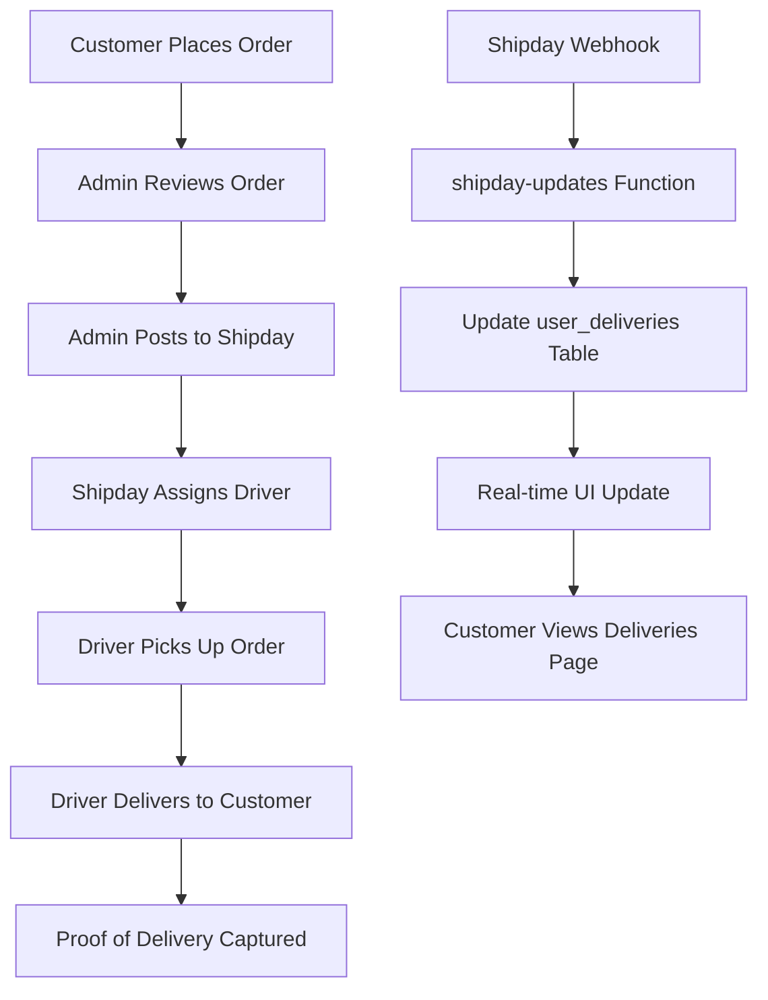

# 🚚 DELIVERY SYSTEM IMPLEMENTATION GUIDE

**Alpha Appeal Platform**  
**Implementation Date:** March 31, 2026  
**Status:** Ready for Implementation  

---

## 📊 EXECUTIVE SUMMARY

The Alpha Appeal delivery system integrates with **Shipday** (third-party delivery platform) to provide real-time order tracking, driver assignment, and delivery management. The system supports both standard deliveries and premium concierge services.

### Current Architecture



---

## 🗄️ DATABASE SCHEMA

### user_deliveries Table Structure

```sql
CREATE TABLE public.user_deliveries (
  id UUID PRIMARY KEY DEFAULT uuid_generate_v4(),
  order_id UUID REFERENCES public.orders(id),
  user_id UUID REFERENCES auth.users(id),
  
  -- Shipday Integration
  shipday_order_id TEXT,
  shipday_status TEXT,
  shipday_last_sync TIMESTAMPTZ,
  
  -- Delivery Details
  pickup_address TEXT,
  delivery_address TEXT,
  delivery_fee DECIMAL DEFAULT 0,
  delivery_fee_original DECIMAL DEFAULT 0,
  distance_km DECIMAL,
  
  -- Driver Information
  driver_name TEXT,
  driver_phone TEXT,
  driver_latitude DECIMAL,
  driver_longitude DECIMAL,
  
  -- Tracking
  tracking_url TEXT,
  tracking_number TEXT,
  eta_minutes INTEGER,
  estimated_delivery TIMESTAMPTZ,
  
  -- Status Timeline
  status TEXT, -- pending, assigned, in_transit, picked_up, delivered, failed
  geofence_arrived_at TIMESTAMPTZ,
  geofence_left_at TIMESTAMPTZ,
  delivered_at TIMESTAMPTZ,
  
  -- Proof of Delivery
  pod_photo_url TEXT,
  pod_signature_url TEXT,
  
  -- Admin Features
  priority TEXT DEFAULT 'normal',
  admin_notes TEXT,
  concierge BOOLEAN DEFAULT false,
  
  -- Metadata
  provider TEXT,
  raw_shipday_payload JSONB,
  
  -- Timestamps
  created_at TIMESTAMPTZ DEFAULT NOW(),
  updated_at TIMESTAMPTZ DEFAULT NOW()
);
```

### Indexes for Performance

```sql
-- Fast user lookups
CREATE INDEX idx_user_deliveries_user ON user_deliveries(user_id);

-- Active deliveries
CREATE INDEX idx_user_deliveries_status ON user_deliveries(status) 
  WHERE status NOT IN ('delivered', 'failed');

-- Shipday order mapping
CREATE INDEX idx_user_deliveries_shipday ON user_deliveries(shipday_order_id);

-- Recent deliveries
CREATE INDEX idx_user_deliveries_created ON user_deliveries(created_at DESC);
```

---

## 🔄 DELIVERY LIFECYCLE

### Stage 1: Order Placement
```typescript
// User places order in shop
POST /shop/checkout
{
  items: [...],
  delivery_address: {...},
  payment_method: "payfast"
}

// Order created with status: "pending"
orders table:
  - payment_status: "pending" → "completed"
  - fulfillment_status: "unfulfilled"
```

### Stage 2: Admin Dispatch
```typescript
// Admin creates delivery via admin dashboard
POST /functions/v1/post-to-shipday
{
  order_id: "uuid",
  pickup_address: "Alpha HQ",
  delivery_address: "Customer address",
  customer_name: "John Doe",
  customer_phone: "+27...",
  customer_email: "john@example.com",
  order_items: [...],
  priority: "normal|rush",
  admin_notes: "Handle with care"
}

// Response
{
  success: true,
  shipday_order_id: "SHIP-12345",
  delivery_fee: 85.50,
  distance_km: 12.3,
  tracking_url: "https://track.shipday.com/..."
}
```

### Stage 3: Driver Assignment
```typescript
// Shipday webhook triggers update
POST /functions/v1/shipday-updates
{
  id: "SHIP-12345",
  orderNumber: "ORD-123",
  orderStatus: "ASSIGNED",
  assignedCarrier: {
    name: "John Driver",
    phone: "+27...",
    latitude: -26.123,
    longitude: 28.456
  }
}

// Database update
user_deliveries:
  - status: "assigned"
  - driver_name: "John Driver"
  - driver_phone: "+27..."
  - driver_latitude: -26.123
  - driver_longitude: 28.456
```

### Stage 4: In Transit
```typescript
// Driver picks up order
Shipday webhook: { orderStatus: "PICKED_UP" }

// Update
user_deliveries:
  - status: "in_transit"
  - geofence_arrived_at: "2026-03-31T10:30:00Z"
  - eta_minutes: 25
```

### Stage 5: Out for Delivery
```typescript
// Driver en route
Shipday webhook: { orderStatus: "STARTED" }

// Update
user_deliveries:
  - status: "picked_up"
  - eta_minutes: 15
  - tracking_url: "https://..."
```

### Stage 6: Delivered
```typescript
// Delivery completed
Shipday webhook: { 
  orderStatus: "COMPLETED",
  proofOfDelivery: {
    photoUrl: "https://...",
    signatureUrl: "https://..."
  }
}

// Update
user_deliveries:
  - status: "delivered"
  - delivered_at: NOW()
  - pod_photo_url: "https://..."
  - pod_signature_url: "https://..."

// Also update order
orders:
  - payment_status: "completed"
  - fulfilled_at: NOW()
```

---

## 🔧 ENHANCEMENT PLAN

### Phase 1: Security & Validation (CRITICAL)

#### 1.1 Add Input Validation to `post-to-shipday`

**File:** `supabase/functions/post-to-shipday/index.ts`

```typescript
import { validateRequest, PostToShipdaySchema } from "../_shared/validation.ts";

// In the request handler:
const body = await req.json();
const validationResult = validateRequest(PostToShipdaySchema, body);

if (!validationResult.success) {
  return new Response(
    JSON.stringify({ error: validationResult.error }),
    { status: 400, headers: corsHeaders }
  );
}

const { order_id, customer_name, customer_email, ... } = validationResult.data;
```

#### 1.2 Add Webhook Signature Verification

**File:** `supabase/functions/shipday-updates/index.ts`

```typescript
// Verify Shipday webhook signature
const SHIPDAY_WEBHOOK_SECRET = Deno.env.get("SHIPDAY_WEBHOOK_SECRET");
const signature = req.headers.get("X-Shipday-Signature");

if (signature && SHIPDAY_WEBHOOK_SECRET) {
  const isValid = await verifyWebhookSignature(payload, signature, SHIPDAY_WEBHOOK_SECRET);
  if (!isValid) {
    console.error("Invalid Shipday webhook signature");
    return new Response("INVALID_SIGNATURE", { status: 401 });
  }
}
```

#### 1.3 Create Signature Verification Utility

**File:** `supabase/functions/_shared/shipday.ts`

```typescript
import { createHash } from "https://deno.land/std@0.190.0/hash/mod.ts";

export async function verifyWebhookSignature(
  payload: any,
  signature: string,
  secret: string
): Promise<boolean> {
  const encoder = new TextEncoder();
  const data = encoder.encode(JSON.stringify(payload));
  const keyData = encoder.encode(secret);
  
  const cryptoKey = await crypto.subtle.importKey(
    "raw",
    keyData,
    { name: "HMAC", hash: "SHA-256" },
    false,
    ["sign", "verify"]
  );
  
  const expectedSig = await crypto.subtle.sign("HMAC", cryptoKey, data);
  const expectedHex = Array.from(new Uint8Array(expectedSig))
    .map(b => b.toString(16).padStart(2, "0"))
    .join("");
  
  // Constant-time comparison
  return constantTimeCompare(signature, expectedHex);
}

function constantTimeCompare(a: string, b: string): boolean {
  if (a.length !== b.length) return false;
  let result = 0;
  for (let i = 0; i < a.length; i++) {
    result |= a.charCodeAt(i) ^ b.charCodeAt(i);
  }
  return result === 0;
}
```

---

### Phase 2: Notification System

#### 2.1 Create Notification Service

**File:** `supabase/functions/_shared/notifications.ts`

```typescript
import { createClient } from "https://esm.sh/@supabase/supabase-js@2";

export async function sendDeliveryNotification(
  userId: string,
  type: "driver_assigned" | "out_for_delivery" | "delivered" | "failed",
  deliveryData: any
) {
  const supabase = createClient(
    Deno.env.get("SUPABASE_URL")!,
    Deno.env.get("SUPABASE_SERVICE_ROLE_KEY")!
  );
  
  // Get user email and phone
  const { data: user } = await supabase
    .from("profiles")
    .select("email, phone")
    .eq("id", userId)
    .single();
  
  if (!user) return;
  
  // Send based on preference
  const notification = {
    user_id: userId,
    type: "delivery_update",
    title: getNotificationTitle(type),
    message: getNotificationMessage(type, deliveryData),
    metadata: deliveryData,
  };
  
  // Insert notification
  await supabase.from("user_notifications").insert(notification);
  
  // Send email if available
  if (user.email) {
    await sendEmail({
      to: user.email,
      subject: notification.title,
      html: renderEmailTemplate(type, deliveryData),
    });
  }
  
  // Send SMS if urgent and phone available
  if (user.phone && ["delivered", "failed"].includes(type)) {
    await sendSMS({
      to: user.phone,
      body: `${notification.title}: ${notification.message}`,
    });
  }
}

function getNotificationTitle(type: string): string {
  const titles = {
    driver_assigned: "🚗 Driver Assigned!",
    out_for_delivery: "📦 Out for Delivery",
    delivered: "✅ Delivery Complete",
    failed: "⚠️ Delivery Attempt Failed",
  };
  return titles[type as keyof typeof titles];
}

function getNotificationMessage(type: string, data: any): string {
  switch (type) {
    case "driver_assigned":
      return `Your driver is ${data.driver_name}. Call: ${data.driver_phone}`;
    case "out_for_delivery":
      return `ETA: ${data.eta_minutes} minutes`;
    case "delivered":
      return "Your order has been delivered successfully!";
    case "failed":
      return "Delivery attempt failed. We'll contact you shortly.";
    default:
      return "Delivery update received";
  }
}
```

#### 2.2 Integrate Notifications into Webhook Handler

**File:** `supabase/functions/shipday-updates/index.ts`

```typescript
import { sendDeliveryNotification } from "../_shared/notifications.ts";

// After updating delivery record:
if (newStatus === "assigned" && d.driver_name) {
  await sendDeliveryNotification(d.user_id, "driver_assigned", {
    driver_name: d.driver_name,
    driver_phone: d.driver_phone,
  });
}

if (newStatus === "in_transit") {
  await sendDeliveryNotification(d.user_id, "out_for_delivery", {
    eta_minutes: d.eta_minutes,
  });
}

if (newStatus === "delivered") {
  await sendDeliveryNotification(d.user_id, "delivered", {
    delivered_at: new Date().toISOString(),
    pod_photo_url: d.pod_photo_url,
  });
}
```

---

### Phase 3: Enhanced Tracking Features

#### 3.1 Live Driver Tracking Map

**Enhancement to Deliveries.tsx:**

```tsx
// Add live map component
import { MapContainer, TileLayer, Marker, Popup } from "react-leaflet";

const DriverLiveMap = ({ delivery }: { delivery: any }) => {
  if (!delivery.driver_latitude || !delivery.driver_longitude) {
    return null;
  }
  
  return (
    <MapContainer
      center={[delivery.driver_latitude, delivery.driver_longitude]}
      zoom={15}
      style={{ height: "300px", width: "100%", borderRadius: "12px" }}
    >
      <TileLayer
        url="https://{s}.tile.openstreetmap.org/{z}/{x}/{y}.png"
      />
      <Marker position={[delivery.delivery_latitude, delivery.delivery_longitude]}>
        <Popup>Delivery Location</Popup>
      </Marker>
      <Marker position={[delivery.driver_latitude, delivery.driver_longitude]}>
        <Popup>{delivery.driver_name} (Driver)</Popup>
      </Marker>
    </MapContainer>
  );
};
```

#### 3.2 Delivery Timeline

```tsx
const DeliveryTimeline = ({ delivery }: { delivery: any }) => {
  const events = [
    { status: "pending", label: "Order Placed", date: delivery.created_at },
    { status: "assigned", label: "Driver Assigned", date: delivery.assigned_at },
    { status: "picked_up", label: "Picked Up", date: delivery.geofence_arrived_at },
    { status: "in_transit", label: "Out for Delivery", date: delivery.left_pickup_at },
    { status: "delivered", label: "Delivered", date: delivery.delivered_at },
  ];
  
  return (
    <div className="space-y-3">
      {events.map((event, idx) => (
        <div key={event.status} className="flex items-center gap-3">
          <div className={`w-3 h-3 rounded-full ${
            delivery.status === event.status ? "bg-secondary" : "bg-muted"
          }`} />
          <span className={delivery.status === event.status ? "font-semibold" : ""}>
            {event.label}
          </span>
          {event.date && (
            <span className="text-xs text-muted-foreground">
              {format(new Date(event.date), "MMM d, h:mm a")}
            </span>
          )}
        </div>
      ))}
    </div>
  );
};
```

---

### Phase 4: Analytics & Reporting

#### 4.1 Delivery Metrics Dashboard

**SQL Queries for Analytics:**

```sql
-- Average delivery time (minutes)
SELECT 
  AVG(EXTRACT(EPOCH FROM (delivered_at - created_at))/60) as avg_delivery_time
FROM user_deliveries
WHERE status = 'delivered'
  AND delivered_at > NOW() - INTERVAL '30 days';

-- Delivery success rate
SELECT 
  COUNT(CASE WHEN status = 'delivered' THEN 1 END) * 100.0 / COUNT(*) as success_rate
FROM user_deliveries
WHERE created_at > NOW() - INTERVAL '30 days';

-- Most active delivery areas
SELECT 
  LEFT(delivery_address, 20) as area,
  COUNT(*) as delivery_count,
  AVG(delivery_fee) as avg_fee
FROM user_deliveries
GROUP BY area
ORDER BY delivery_count DESC
LIMIT 10;

-- Driver performance
SELECT 
  driver_name,
  COUNT(*) as total_deliveries,
  AVG(EXTRACT(EPOCH FROM (delivered_at - assigned_at))/60) as avg_time,
  COUNT(CASE WHEN status = 'delivered' THEN 1 END) * 100.0 / COUNT(*) as success_rate
FROM user_deliveries
WHERE driver_name IS NOT NULL
GROUP BY driver_name
ORDER BY total_deliveries DESC;
```

#### 4.2 Admin Dashboard Enhancements

Add to `src/components/admin/DeliveriesTab.tsx`:

```tsx
// Delivery stats cards
const stats = [
  { label: "Active", value: activeCount, icon: Truck, color: "text-blue-400" },
  { label: "Completed Today", value: todayCount, icon: CheckCircle, color: "text-secondary" },
  { label: "Failed", value: failedCount, icon: Clock, color: "text-destructive" },
  { label: "Avg Time", value: `${avgTime}m`, icon: Clock, color: "text-amber-400" },
];

{stats.map(({ label, value, icon: Icon, color }) => (
  <div key={label} className="p-4 rounded-xl bg-card/50 border border-border/50">
    <div className="flex items-center justify-between mb-2">
      <Icon className={`w-5 h-5 ${color}`} />
      <span className="text-2xl font-bold">{value}</span>
    </div>
    <p className="text-sm text-muted-foreground">{label}</p>
  </div>
))}
```

---

### Phase 5: Error Handling & Retry Logic

#### 5.1 Robust Error Handling

**File:** `supabase/functions/post-to-shipday/index.ts`

```typescript
try {
  const shipdayRes = await fetch("https://api.shipday.com/orders", {
    method: "POST",
    headers: {
      "Content-Type": "application/json",
      Authorization: `Basic ${SHIPDAY_API_KEY}`,
    },
    body: JSON.stringify(shipdayPayload),
  });
  
  if (!shipdayRes.ok) {
    const errorData = await shipdayRes.json();
    
    // Handle specific errors
    if (shipdayRes.status === 429) {
      // Rate limited - retry later
      await supabase.from("delivery_retry_queue").insert({
        order_id,
        retry_after: new Date(Date.now() + 60000).toISOString(),
        attempts: 0,
      });
      
      return new Response(
        JSON.stringify({ error: "Rate limited, will retry", retry: true }),
        { status: 429 }
      );
    }
    
    if (shipdayRes.status === 400) {
      // Invalid address
      return new Response(
        JSON.stringify({ 
          error: "Invalid delivery address",
          details: errorData 
        }),
        { status: 400 }
      );
    }
    
    throw new Error(`Shipday API error: ${shipdayRes.status}`);
  }
  
  const shipdayData = await shipdayRes.json();
  // ... continue processing
  
} catch (err) {
  console.error("Post to Shipday error:", err);
  
  // Log error for monitoring
  await supabase.from("delivery_errors").insert({
    order_id,
    error_type: "shipday_post_failed",
    error_message: err.message,
    occurred_at: new Date().toISOString(),
  });
  
  return new Response(
    JSON.stringify({ error: "Failed to create delivery", retry: true }),
    { status: 500 }
  );
}
```

#### 5.2 Retry Queue System

**Migration:**

```sql
CREATE TABLE public.delivery_retry_queue (
  id UUID PRIMARY KEY DEFAULT uuid_generate_v4(),
  order_id UUID NOT NULL,
  delivery_id UUID,
  error_type TEXT,
  error_message TEXT,
  attempts INTEGER DEFAULT 0,
  max_attempts INTEGER DEFAULT 3,
  retry_after TIMESTAMPTZ,
  created_at TIMESTAMPTZ DEFAULT NOW(),
  last_attempt_at TIMESTAMPTZ,
  resolved BOOLEAN DEFAULT false,
  resolved_at TIMESTAMPTZ
);

CREATE INDEX idx_delivery_retry_queue_pending 
  ON delivery_retry_queue(retry_after, resolved) 
  WHERE resolved = false;
```

**Edge Function for Processing Retries:**

**File:** `supabase/functions/process-delivery-retries/index.ts`

```typescript
Deno.serve(async () => {
  const supabase = createClient(
    Deno.env.get("SUPABASE_URL")!,
    Deno.env.get("SUPABASE_SERVICE_ROLE_KEY")!
  );
  
  // Get pending retries
  const { data: retries } = await supabase
    .from("delivery_retry_queue")
    .select("*")
    .eq("resolved", false)
    .lte("retry_after", new Date().toISOString())
    .lt("attempts", 3)
    .limit(10);
  
  if (!retries?.length) {
    return new Response(JSON.stringify({ processed: 0 }));
  }
  
  let processed = 0;
  
  for (const retry of retries) {
    try {
      // Re-post to Shipday
      await postToShipday(retry.order_id);
      
      // Mark as resolved
      await supabase
        .from("delivery_retry_queue")
        .update({ resolved: true, resolved_at: new Date().toISOString() })
        .eq("id", retry.id);
      
      processed++;
    } catch (err) {
      // Increment attempts
      await supabase
        .from("delivery_retry_queue")
        .update({
          attempts: retry.attempts + 1,
          last_attempt_at: new Date().toISOString(),
          retry_after: new Date(Date.now() + Math.pow(2, retry.attempts) * 60000), // Exponential backoff
        })
        .eq("id", retry.id);
    }
  }
  
  return new Response(JSON.stringify({ processed }));
});
```

---

## 📋 IMPLEMENTATION CHECKLIST

### Security & Validation
- [ ] Add Zod validation to `post-to-shipday` function
- [ ] Add webhook signature verification to `shipday-updates`
- [ ] Create Shipday utility functions
- [ ] Test with invalid/malformed payloads
- [ ] Add rate limiting to webhook endpoint

### Notifications
- [ ] Create notification service utility
- [ ] Implement email templates
- [ ] Set up SMS integration (Twilio/AWS SNS)
- [ ] Add notification preferences to user settings
- [ ] Test all notification types

### Enhanced Tracking
- [ ] Add live map to Deliveries page
- [ ] Implement delivery timeline component
- [ ] Add push notifications for web/mobile
- [ ] Enable driver chat/messaging
- [ ] Add delivery photo gallery

### Analytics
- [ ] Create admin metrics dashboard
- [ ] Set up delivery analytics queries
- [ ] Add export functionality (CSV/PDF)
- [ ] Implement automated reports
- [ ] Track delivery SLA compliance

### Error Handling
- [ ] Create retry queue system
- [ ] Implement exponential backoff
- [ ] Add error logging and monitoring
- [ ] Set up alerts for failed deliveries
- [ ] Create manual retry interface for admins

### Testing
- [ ] Unit tests for edge functions
- [ ] Integration tests with Shipday sandbox
- [ ] End-to-end delivery flow tests
- [ ] Load testing for webhook handler
- [ ] User acceptance testing

---

## 🎯 SUCCESS METRICS

### Key Performance Indicators (KPIs)

1. **Delivery Success Rate**: Target > 95%
2. **Average Delivery Time**: Target < 45 minutes
3. **Customer Satisfaction**: Target > 4.5/5 stars
4. **Failed Delivery Rate**: Target < 3%
5. **Webhook Processing Time**: Target < 500ms
6. **Retry Success Rate**: Target > 80%

### Monitoring Dashboard

Track these metrics in real-time:
- Active deliveries count
- Average ETA accuracy
- Driver response time
- Customer notification open rates
- Error rate by type
- API rate limit usage

---

## 🔐 SECURITY CONSIDERATIONS

### Data Protection
- Encrypt customer addresses at rest
- Mask phone numbers in logs
- Secure API keys in environment variables
- Implement webhook signature verification
- Rate limit webhook endpoints

### Privacy Compliance
- Store delivery data per POPIA/GDPR
- Allow customers to delete delivery history
- Anonymize old delivery records
- Provide data export functionality
- Clear retention policies

---

## 📞 SUPPORT WORKFLOWS

### Common Customer Issues

**Q: "Where is my delivery?"**
```
1. Check user_deliveries table for latest status
2. Verify driver assignment
3. Contact Shipday if driver not moving
4. Issue refund if > 2 hours late
```

**Q: "Wrong address delivered to"**
```
1. Review delivery_address in database
2. Check POD (proof of delivery) photos
3. Contact driver immediately
4. Arrange redelivery or refund
```

**Q: "Damaged items received"**
```
1. Request photos from customer
2. Review POD photos
3. File claim with Shipday
4. Send replacement or refund
```

### Admin Escalation Paths

1. **Level 1**: Automated retry for failed API calls
2. **Level 2**: Manual dispatch via admin dashboard
3. **Level 3**: Direct Shipday support contact
4. **Level 4**: Refund and customer recovery

---

## 🚀 DEPLOYMENT PLAN

### Week 1: Foundation
- [ ] Deploy security enhancements
- [ ] Implement input validation
- [ ] Set up monitoring and alerting
- [ ] Test with Shipday sandbox

### Week 2: Notifications
- [ ] Deploy notification service
- [ ] Create email templates
- [ ] Set up SMS provider
- [ ] Test all notification flows

### Week 3: Enhanced UX
- [ ] Deploy live tracking map
- [ ] Add delivery timeline
- [ ] Improve mobile responsiveness
- [ ] Beta test with select users

### Week 4: Analytics & Optimization
- [ ] Deploy admin dashboard
- [ ] Set up analytics pipeline
- [ ] Optimize query performance
- [ ] Full production rollout

---

**Next Steps:**
1. Review and approve this implementation plan
2. Prioritize features for MVP
3. Set up development environment
4. Begin Phase 1 implementation

**Questions or clarifications needed?** Let me know which phase to start with!
