# 🚚 UBER EATS-STYLE DELIVERY SYSTEM ENHANCEMENT

**Implementation Date:** March 31, 2026  
**Status:** Ready for Implementation  
**Priority:** High  

---

## 🎯 EXECUTIVE SUMMARY

Transform the Alpha Appeal delivery system into an Uber Eats-style platform where:
- **Delivery drivers** operate as independent contractors
- **Vendors** have full visibility and control over their deliveries
- **Admins** oversee the entire delivery network
- **Customers** get real-time tracking and transparency

### Key Features
✅ Dual Dashboard (Vendor + Admin) with identical delivery monitoring capabilities  
✅ Real-time driver tracking on interactive maps  
✅ Live status updates synchronized across all interfaces  
✅ Delivery assignment management (assign/unassign drivers)  
✅ Customer-facing delivery tracking page  
✅ Push notifications for all stakeholders  
✅ Complete delivery pipeline visibility  

---

## 📊 USER ROLES & CAPABILITIES

### 1. **Customer (End User)**
**View & Track:**
- Own delivery orders in real-time
- Driver location and route
- Estimated arrival time
- Driver contact information
- Delivery history
- Status updates (pending → assigned → in-transit → delivered)

**Actions:**
- Contact driver (call/SMS)
- View delivery details
- Rate delivery experience
- Report issues

---

### 2. **Vendor (Restaurant/Store Owner)**
**Dashboard Capabilities:**
- View ALL deliveries for their store(s)
- Monitor delivery pipeline from creation to completion
- Real-time driver tracking
- Assign/unassign drivers to orders
- Update order readiness status
- Manage delivery schedule
- Access analytics and performance metrics

**Specific Features:**
- Filter by status (pending, assigned, in-transit, delivered)
- See which orders are ready for pickup
- Monitor driver ETA to customer
- View delivery history and trends
- Receive notifications for new orders
- Coordinate with drivers

---

### 3. **Admin (Platform Operator)**
**Dashboard Capabilities:**
- OVERSIGHT: View ALL deliveries across ALL vendors
- Network-wide monitoring
- Driver performance analytics
- System health monitoring
- Override capabilities (reassign, cancel, refund)
- Advanced analytics and reporting

**Specific Features:**
- Global delivery map view
- Vendor performance comparison
- Driver ratings and statistics
- Revenue and fee tracking
- Dispute resolution
- System configuration

---

## 🗺️ SYSTEM ARCHITECTURE

```mermaid
graph TB
    subgraph "Customer Interface"
        C1[My Deliveries Page]
        C2[Real-time Tracking]
        C3[Driver Map View]
        C4[Delivery History]
    end
    
    subgraph "Vendor Interface"
        V1[Vendor Dashboard]
        V2[Delivery Management]
        V3[Driver Assignment]
        V4[Order Readiness]
        V5[Analytics]
    end
    
    subgraph "Admin Interface"
        A1[Global Dashboard]
        A2[Network Monitoring]
        A3[All Deliveries View]
        A4[Driver Management]
        A5[System Analytics]
    end
    
    subgraph "Driver App (Independent)"
        D1[Accept/Decline Orders]
        D2[Navigation & Routing]
        D3[Status Updates]
        D4[Earnings Tracker]
    end
    
    subgraph "Backend Services"
        B1[Shipday Integration]
        B2[Real-time Sync]
        B3[Notification Service]
        B4[Location Tracking]
    end
    
    C1 --> B2
    V1 --> B2
    A1 --> B2
    D1 --> B2
    B2 --> B1
    B3 --> C1
    B3 --> V1
    B3 --> A1
    B4 --> B2
```



---

## 📱 COMPONENT BREAKDOWN

### Phase 1: Database Enhancements ✅

#### 1.1 Enhanced Delivery Schema
```sql
-- Add vendor-specific columns to user_deliveries
ALTER TABLE user_deliveries ADD COLUMN IF NOT EXISTS vendor_id UUID REFERENCES alpha_partners(id);
ALTER TABLE user_deliveries ADD COLUMN IF NOT EXISTS vendor_ready BOOLEAN DEFAULT FALSE;
ALTER TABLE user_deliveries ADD COLUMN IF NOT EXISTS driver_rating INTEGER CHECK (driver_rating >= 1 AND driver_rating <= 5);
ALTER TABLE user_deliveries ADD COLUMN IF NOT EXISTS customer_rating INTEGER CHECK (customer_rating >= 1 AND customer_rating <= 5);
ALTER TABLE user_deliveries ADD COLUMN IF NOT EXISTS delivery_route JSONB; -- GeoJSON route
ALTER TABLE user_deliveries ADD COLUMN IF NOT EXISTS estimated_arrival TIMESTAMPTZ;
```

#### 1.2 Driver Management Table
```sql
CREATE TABLE delivery_drivers (
  id UUID PRIMARY KEY DEFAULT uuid_generate_v4(),
  user_id UUID REFERENCES auth.users(id),
  vendor_id UUID REFERENCES alpha_partners(id), -- Null = independent contractor
  is_independent_contractor BOOLEAN DEFAULT TRUE,
  is_available BOOLEAN DEFAULT TRUE,
  current_latitude DECIMAL,
  current_longitude DECIMAL,
  rating DECIMAL(3,2) DEFAULT 5.0,
  total_deliveries INTEGER DEFAULT 0,
  vehicle_type TEXT,
  vehicle_plate TEXT,
  background_check_status TEXT DEFAULT 'pending',
  created_at TIMESTAMPTZ DEFAULT NOW(),
  updated_at TIMESTAMPTZ DEFAULT NOW()
);

-- Index for finding nearby drivers
CREATE INDEX idx_delivery_drivers_location ON delivery_drivers(current_latitude, current_longitude) 
  WHERE is_available = TRUE;
```

#### 1.3 Delivery Assignments Table
```sql
CREATE TABLE delivery_assignments (
  id UUID PRIMARY KEY DEFAULT uuid_generate_v4(),
  delivery_id UUID REFERENCES user_deliveries(id),
  driver_id UUID REFERENCES delivery_drivers(id),
  assigned_by UUID REFERENCES auth.users(id),
  assigned_at TIMESTAMPTZ DEFAULT NOW(),
  accepted_at TIMESTAMPTZ,
  picked_up_at TIMESTAMPTZ,
  delivered_at TIMESTAMPTZ,
  status TEXT, -- pending, accepted, en_route_to_pickup, at_pickup, en_route_to_customer, delivered, cancelled
  rejection_reason TEXT,
  created_at TIMESTAMPTZ DEFAULT NOW()
);

CREATE INDEX idx_delivery_assignments_active ON delivery_assignments(delivery_id, status) 
  WHERE status NOT IN ('delivered', 'cancelled');
```

---

### Phase 2: Vendor Dashboard Implementation

#### 2.1 Create Vendor Deliveries Component

**File:** `src/components/vendor/VendorDeliveries.tsx`

```tsx
import { useState, useEffect, useCallback } from "react";
import { supabase } from "@/integrations/supabase/client";
import { useToast } from "@/hooks/use-toast";
import { Button } from "@/components/ui/button";
import { Badge } from "@/components/ui/badge";
import { Card, CardContent, CardHeader, CardTitle } from "@/components/ui/card";
import {
  Truck, Package, Clock, CheckCircle, MapPin, Phone, MessageCircle,
  Loader2, RefreshCw, Filter, Search, Calendar, BarChart3,
} from "lucide-react";
import { format } from "date-fns";
import { VendorDeliveryMap } from "./VendorDeliveryMap";

interface VendorDeliveriesProps {
  partnerId: string;
}

const VendorDeliveries = ({ partnerId }: VendorDeliveriesProps) => {
  const { toast } = useToast();
  const [deliveries, setDeliveries] = useState<any[]>([]);
  const [loading, setLoading] = useState(true);
  const [filter, setFilter] = useState("all"); // all, pending, active, completed
  const [searchQuery, setSearchQuery] = useState("");
  const [selectedDelivery, setSelectedDelivery] = useState<any>(null);
  const [showMap, setShowMap] = useState(false);

  const loadDeliveries = useCallback(async () => {
    setLoading(true);
    try {
      const { data, error } = await supabase
        .from("user_deliveries")
        .select(`
          *,
          orders(order_number, product_name, amount, created_at),
          driver:delivery_drivers(name, phone, rating, vehicle_type)
        `)
        .eq("vendor_id", partnerId)
        .order("created_at", { ascending: false });

      if (error) throw error;
      setDeliveries(data || []);
    } catch (error: any) {
      console.error("Error loading deliveries:", error);
      toast({
        title: "Error",
        description: "Failed to load deliveries",
        variant: "destructive",
      });
    } finally {
      setLoading(false);
    }
  }, [partnerId, toast]);

  useEffect(() => {
    loadDeliveries();
  }, [loadDeliveries]);

  // Real-time subscription
  useEffect(() => {
    const channel = supabase
      .channel(`vendor-deliveries-${partnerId}`)
      .on("postgres_changes", {
        event: "*",
        schema: "public",
        table: "user_deliveries",
        filter: `vendor_id=eq.${partnerId}`,
      }, () => loadDeliveries())
      .subscribe();

    return () => {
      supabase.removeChannel(channel);
    };
  }, [partnerId, loadDeliveries]);

  const handleAssignDriver = async (deliveryId: string, driverId: string) => {
    try {
      const { error } = await supabase
        .from("user_deliveries")
        .update({
          driver_id: driverId,
          status: "assigned",
          updated_at: new Date().toISOString(),
        })
        .eq("id", deliveryId);

      if (error) throw error;

      toast({
        title: "Success",
        description: "Driver assigned successfully",
      });

      loadDeliveries();
    } catch (error: any) {
      toast({
        title: "Error",
        description: error.message,
        variant: "destructive",
      });
    }
  };

  const handleUpdateReadiness = async (deliveryId: string, isReady: boolean) => {
    try {
      const { error } = await supabase
        .from("user_deliveries")
        .update({
          vendor_ready: isReady,
          updated_at: new Date().toISOString(),
        })
        .eq("id", deliveryId);

      if (error) throw error;

      toast({
        title: "Success",
        description: isReady ? "Order marked as ready" : "Order marked as not ready",
      });

      loadDeliveries();
    } catch (error: any) {
      toast({
        title: "Error",
        description: error.message,
        variant: "destructive",
      });
    }
  };

  const filteredDeliveries = deliveries.filter(d => {
    const matchesFilter = filter === "all" || 
      (filter === "pending" && d.status === "pending") ||
      (filter === "active" && ["assigned", "in_transit", "picked_up"].includes(d.status)) ||
      (filter === "completed" && d.status === "delivered");
    
    const matchesSearch = searchQuery === "" ||
      d.orders?.order_number?.toLowerCase().includes(searchQuery.toLowerCase()) ||
      d.driver?.name?.toLowerCase().includes(searchQuery.toLowerCase());
    
    return matchesFilter && matchesSearch;
  });

  const stats = {
    total: deliveries.length,
    pending: deliveries.filter(d => d.status === "pending").length,
    active: deliveries.filter(d => ["assigned", "in_transit", "picked_up"].includes(d.status)).length,
    completed: deliveries.filter(d => d.status === "delivered").length,
  };

  return (
    <div className="space-y-6">
      {/* Stats Cards */}
      <div className="grid gap-4 md:grid-cols-4">
        <Card>
          <CardHeader className="flex flex-row items-center justify-between space-y-0 pb-2">
            <CardTitle className="text-sm font-medium">Total</CardTitle>
            <Package className="h-4 w-4 text-muted-foreground" />
          </CardHeader>
          <CardContent>
            <div className="text-2xl font-bold">{stats.total}</div>
          </CardContent>
        </Card>
        <Card>
          <CardHeader className="flex flex-row items-center justify-between space-y-0 pb-2">
            <CardTitle className="text-sm font-medium">Pending</CardTitle>
            <Clock className="h-4 w-4 text-amber-500" />
          </CardHeader>
          <CardContent>
            <div className="text-2xl font-bold">{stats.pending}</div>
          </CardContent>
        </Card>
        <Card>
          <CardHeader className="flex flex-row items-center justify-between space-y-0 pb-2">
            <CardTitle className="text-sm font-medium">Active</CardTitle>
            <Truck className="h-4 w-4 text-blue-500" />
          </CardHeader>
          <CardContent>
            <div className="text-2xl font-bold">{stats.active}</div>
          </CardContent>
        </Card>
        <Card>
          <CardHeader className="flex flex-row items-center justify-between space-y-0 pb-2">
            <CardTitle className="text-sm font-medium">Completed</CardTitle>
            <CheckCircle className="h-4 w-4 text-green-500" />
          </CardHeader>
          <CardContent>
            <div className="text-2xl font-bold">{stats.completed}</div>
          </CardContent>
        </Card>
      </div>

      {/* Filters & Search */}
      <div className="flex items-center gap-4">
        <div className="flex-1">
          <Input
            placeholder="Search by order # or driver..."
            value={searchQuery}
            onChange={(e) => setSearchQuery(e.target.value)}
            className="max-w-sm"
          />
        </div>
        <Select value={filter} onValueChange={setFilter}>
          <SelectTrigger className="w-[180px]">
            <SelectValue placeholder="Filter by status" />
          </SelectTrigger>
          <SelectContent>
            <SelectItem value="all">All Deliveries</SelectItem>
            <SelectItem value="pending">Pending</SelectItem>
            <SelectItem value="active">Active</SelectItem>
            <SelectItem value="completed">Completed</SelectItem>
          </SelectContent>
        </Select>
        <Button onClick={() => setShowMap(!showMap)} variant="outline">
          <MapPin className="w-4 h-4 mr-2" />
          {showMap ? "Hide Map" : "Show Map"}
        </Button>
        <Button onClick={loadDeliveries} size="icon" variant="ghost">
          <RefreshCw className={`w-4 h-4 ${loading ? "animate-spin" : ""}`} />
        </Button>
      </div>

      {/* Map View */}
      {showMap && (
        <Card>
          <CardContent className="p-0">
            <VendorDeliveryMap deliveries={deliveries.filter(d => d.driver_latitude && d.driver_longitude)} />
          </CardContent>
        </Card>
      )}

      {/* Deliveries List */}
      {loading ? (
        <div className="flex items-center justify-center py-12">
          <Loader2 className="w-8 h-8 animate-spin" />
        </div>
      ) : filteredDeliveries.length === 0 ? (
        <Card>
          <CardContent className="py-12 text-center text-muted-foreground">
            No deliveries found
          </CardContent>
        </Card>
      ) : (
        <div className="space-y-4">
          {filteredDeliveries.map((delivery) => (
            <DeliveryCard
              key={delivery.id}
              delivery={delivery}
              onAssignDriver={handleAssignDriver}
              onUpdateReadiness={handleUpdateReadiness}
              onViewDetails={() => setSelectedDelivery(delivery)}
            />
          ))}
        </div>
      )}
    </div>
  );
};

// Individual Delivery Card Component
const DeliveryCard = ({ delivery, onAssignDriver, onUpdateReadiness, onViewDetails }) => {
  const statusConfig = {
    pending: { label: "Pending", color: "bg-amber-500" },
    assigned: { label: "Driver Assigned", color: "bg-blue-500" },
    in_transit: { label: "In Transit", color: "bg-purple-500" },
    picked_up: { label: "Picked Up", color: "bg-indigo-500" },
    delivered: { label: "Delivered", color: "bg-green-500" },
    failed: { label: "Failed", color: "bg-red-500" },
  };

  const status = statusConfig[delivery.status as keyof typeof statusConfig] || statusConfig.pending;

  return (
    <Card>
      <CardContent className="p-4">
        <div className="flex items-start justify-between">
          <div className="flex-1">
            <div className="flex items-center gap-2 mb-2">
              <Badge className={status.color}>{status.label}</Badge>
              <span className="text-sm text-muted-foreground">
                {format(new Date(delivery.created_at), "MMM d, h:mm a")}
              </span>
            </div>
            
            <h3 className="font-semibold text-lg mb-1">
              {delivery.orders?.product_name || delivery.orders?.order_number}
            </h3>
            
            <div className="grid grid-cols-2 gap-4 mt-3 text-sm">
              <div>
                <span className="text-muted-foreground">Customer:</span>
                <span className="ml-2 font-medium">{delivery.customer_name || "N/A"}</span>
              </div>
              <div>
                <span className="text-muted-foreground">Address:</span>
                <span className="ml-2 font-medium">{delivery.delivery_address || "N/A"}</span>
              </div>
              {delivery.driver && (
                <>
                  <div>
                    <span className="text-muted-foreground">Driver:</span>
                    <span className="ml-2 font-medium">{delivery.driver.name}</span>
                  </div>
                  <div>
                    <span className="text-muted-foreground">ETA:</span>
                    <span className="ml-2 font-medium">
                      {delivery.eta_minutes ? `${delivery.eta_minutes} min` : "—"}
                    </span>
                  </div>
                </>
              )}
            </div>

            {/* Actions */}
            <div className="flex items-center gap-2 mt-4">
              {delivery.status === "pending" && (
                <Button size="sm" onClick={() => onAssignDriver(delivery.id)}>
                  <Truck className="w-4 h-4 mr-2" />
                  Assign Driver
                </Button>
              )}
              
              <Button
                size="sm"
                variant={delivery.vendor_ready ? "default" : "outline"}
                onClick={() => onUpdateReadiness(delivery.id, !delivery.vendor_ready)}
              >
                {delivery.vendor_ready ? "✓ Ready for Pickup" : "Mark as Ready"}
              </Button>
              
              <Button size="sm" variant="outline" onClick={onViewDetails}>
                View Details
              </Button>
              
              {delivery.tracking_url && (
                <Button size="sm" variant="ghost" asChild>
                  <a href={delivery.tracking_url} target="_blank" rel="noopener noreferrer">
                    Track
                  </a>
                </Button>
              )}
            </div>
          </div>
        </div>
      </CardContent>
    </Card>
  );
};

export default VendorDeliveries;
```

---

### Phase 3: Admin Global Dashboard

*(Similar structure but with network-wide oversight)*

---

### Phase 4: Customer Tracking Page

*(Enhanced version of existing Deliveries.tsx)*

---

## 🎯 IMPLEMENTATION ROADMAP

### Week 1: Foundation
- [ ] Database migrations
- [ ] Driver management tables
- [ ] Delivery assignments system
- [ ] RLS policies

### Week 2: Vendor Dashboard
- [ ] VendorDeliveries component
- [ ] Driver assignment UI
- [ ] Real-time map integration
- [ ] Status management

### Week 3: Admin Dashboard
- [ ] Global oversight dashboard
- [ ] Network analytics
- [ ] Driver management
- [ ] Vendor performance metrics

### Week 4: Customer Experience
- [ ] Enhanced tracking page
- [ ] Live map view
- [ ] Driver communication
- [ ] Delivery history

### Week 5: Polish & Testing
- [ ] Push notifications
- [ ] Error handling
- [ ] Performance optimization
- [ ] User acceptance testing

---

**Next Steps:** Begin with database migrations and work through each phase systematically.
